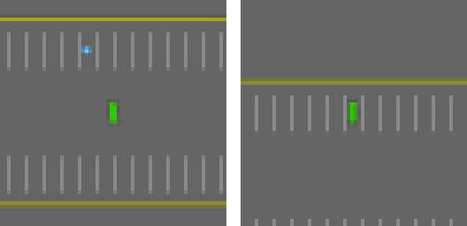

# LeWM: a latent world model for parking

A latent-space world model trained on the `parking-v0` environment from highway-env, with
planning done in the latent space. An encoder turns the top-down view into a latent vector,
an action-conditioned predictor rolls the latent forward, and a planner searches for the
action sequence that brings the latent close to the goal latent.

Learned latent planner (CEM, PD warm start), best episode, about 0.1 m final distance to the
spot. See Results for the reliability limits and the analytic baseline.

## Method

Encoder: a ViT, 64x64 image to a latent of dimension 192.

Predictor: an action-conditioned transformer (acceleration, steering) that predicts the
next-step latent, trained with a prediction loss in latent space.

Regularization: SIGReg (Balestriero and LeCun, LeJEPA, 2025) pushes the latent distribution
toward an isotropic Gaussian. A variance and covariance term (VICReg) is added on top to
prevent latent collapse.

Planning: cross-entropy method (CEM) over action sequences, each sequence scored by the
distance between the predicted end-of-sequence latent and the goal latent, in receding
horizon.

Analytic reference: a hand-written maneuver serves as a reliable privileged controller.
Bounded-curvature Dubins path to an entry pose aligned with the spot, pure-pursuit tracking,
then a final parking step.

## Latent collapse

See WRITEUP.md for the full account. In short: SIGReg standardizes the latents before its
Gaussianity test, which makes it scale invariant, so it does not penalize collapse. Without
another constraint the encoder maps every image to the same point, the planning cost goes
flat, and the planner stops acting. The variance and covariance term fixes this. After the
fix, the per-dimension standard deviation of the latents goes from about 0.05 (collapsed) to
about 1.0, and the planner produces useful actions again.

## Results

Collapse fixed: per-dimension latent standard deviation close to 1.0 throughout training,
prediction loss going down.

Parking, analytic reference controller: 100% strict success over 10 seeds, final distance
about 1.7 cm to the center of the spot, about 0.9 degrees off axis, no collision.

Learned latent planner: drives the car toward the spot but does not reliably reach precise
alignment. This is the current limit, with a modest training set of about 2250 episodes. The
animation above shows its best episode.

## Data

`parking-v0` from highway-env. Trajectories are collected by several policies and stored in
HDF5: image, actions, goal-spot image, and per-episode metadata. Rechunking the observations
per frame speeds up random reads a lot during training.

## Install

See SETUP.md. In short:

    python -m venv .venv
    .venv/bin/pip install -r requirements.txt

## Usage

Collect then rechunk the data:

    python scripts/collect_parking.py --episodes 2500 --out data/parking/train_v2.h5
    python scripts/repack_h5.py --src data/parking/train_v2.h5 --dst data/parking/train_v2_fast.h5

Training:

    python scripts/train.py --data data/parking/train_v2_fast.h5 --out runs/lewm --epochs 4 --device mps

Parking evaluation:

    python scripts/eval_parking.py --planner biarc --episodes 10
    python scripts/eval_parking.py --planner model_warm --episodes 10

Real-time visualization, single window with the planned trajectories overlaid on the scene:

    python scripts/imagine_viewer.py --drive biarc          # parks between the lines
    python scripts/imagine_viewer.py --drive model --warm   # trajectories imagined by the model

## Structure

    src/       encoder, predictor, regularization, environment, metrics, analytic controller
    scripts/   collection, training, planning, evaluation, visualization
    tests/     unit tests

## References

- Balestriero, LeCun. LeJEPA, arXiv:2511.08544, 2025. SIGReg.
- Bardes, Ponce, LeCun. VICReg, 2022. Variance and covariance term.
- Dubins. On curves of minimal length with a constraint on average curvature, 1957.
- highway-env, parking-v0 environment.
